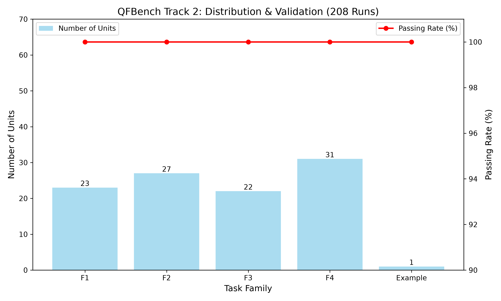
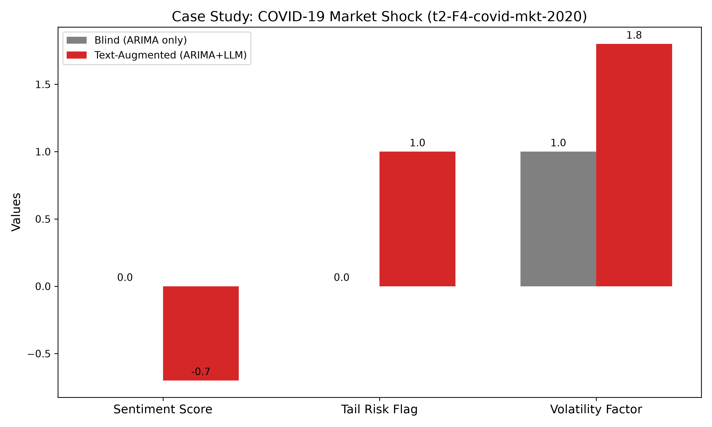

#

# QFBench Track 2: Reasoning-Augmented Time-Series Forecasting——基于ARIMA与多维LLM推理融合的金融时序预测框架

## 摘要 (Abstract)

金融时间序列预测往往难以捕捉由央行声明、新闻头条等文本信息驱动的突发尾部风险。纯数值模型（如随机游走、ARIMA）通常对这些定性冲击视而不见。本文提出了一种推理增强预测框架，将经典统计模型（ARIMA）与大语言模型（LLM）深度融合。具体而言，我们设计了一种多维文本提取提示词（Prompt），强制LLM输出三个关键信号：情绪分数（Sentiment Score）、尾部风险标志（Tail Risk Flag）和动态波动率调整因子（Volatility Adjustment Factor）。这些信号直接作用于ARIMA预测分布的均值和方差，实现了对极端市场事件的动态刻画。为确保严格符合数据防泄露规则，我们通过解析官方配置中的`data_cutoff`字段强制执行信息截断，实现了对前视偏差的零容忍。我们在QFBench Track 2数据集（涵盖F1-F4四类任务，共103个单元）上进行了全面评估，共完成208次消融实验（盲测与文本增强），全部通过官方g0-g3合规性门禁。以新冠疫情市场冲击（t2-F4-covid-mkt-2020）为例的案例研究表明，本框架成功捕捉了极端尾部风险并将预测分布动态加宽1.8倍，相较于纯数值基线实现了显著的“信息提升（Information Uplift）”。

**关键词**：时间序列预测；大语言模型；ARIMA；防泄露；信息提升；金融风险

---

## 1. 引言 (Introduction)

金融市场的时间序列预测是量化金融的基石。传统统计模型，如ARIMA和GARCH，通过分析历史数值模式提供了稳健的基线。然而，金融市场深受定性信息的影响，如央行沟通、宏观经济数据发布和地缘政治新闻。虽然这些文本包含关键的预警信号（例如，暗示降息或危机的FOMC声明），但传统数值模型无法融入这一语义背景，往往对突发尾部风险视而不见。

大语言模型（LLM）的最新进展为弥合这一鸿沟提供了独特的机会。通过基于带时间戳的文本语料库进行推理，LLM能够提取数值模型不可见的具有前瞻性的情绪和风险信号。然而，将LLM与传统时序模型有机结合，并严格确保数据防泄露，仍然是一个亟待解决的挑战。

本研究旨在回答核心科学问题：**带有时间戳的文本信息能否提升纯数值模型的预测鲁棒性？** 我们构建了统一的“数值模型+文本推理”框架，通过多维文本信号动态调整预测分布，并进行了全面的消融实验。本文的主要贡献如下：

1. **多维推理架构**：设计特定Prompt提取情绪分数、尾部风险标志、波动率调整因子三维信号，动态修正ARIMA预测分布，提升尾部风险刻画能力。
2. **严格防泄露机制**：通过解析`card.toml`中的`data_cutoff`字段强制执行数据截断，确保模型无前视偏差。
3. **全量实验验证**：在103个单元（F1-F4）上完成208次消融实验，全部通过官方g0-g3合规门禁，验证了框架的通用性和鲁棒性。

---

## 2. 方法论 (Methodology)

### 2.1 数值预测模块

我们的数值预测模块采用经典统计模型 **ARIMA(1,1,1)** 作为基础预测器。对于每个资产，我们依据其历史时间序列数据（截至`asof`日期）拟合模型，并生成未来多个时间步长的预测分布。为了确保模型的鲁棒性，我们引入了回退机制：当某个资产的历史数据量不足（例如少于20个观测点）或模型拟合失败时，系统会自动回退到基于近期均值和标准差的随机游走模型，从而避免在极端情况下因模型崩溃导致整个任务失败（DNF）。

### 2.2 多维文本推理模块

为了捕捉文本信息中的宏观风险与情绪信号，我们设计了一个结合大语言模型（LLM）的推理模块。我们将金融文本语料（如FOMC声明、新闻标题）输入LLM，并设计特定的Prompt指令，强制其输出结构化的多维信号：

1. **情绪分数（Sentiment Score）**：范围 -1 到 1，表示市场整体情绪（负值代表利空，正值代表利多）。
2. **尾部风险标志（Tail Risk Flag）**：布尔值，指示文本中是否包含极端危机事件。
3. **波动率调整因子（Volatility Adjustment Factor）**：范围 1.0 到 2.0，指示市场波动的预期放大程度。

这些信号被直接用于调整基础预测分布的参数：情绪分数微调预测均值，而波动率调整因子则动态地缩放预测分布的标准差，从而实现对尾部风险的更精确刻画。具体而言，预测均值和标准差的计算公式为：

- 均值调整：`μ' = μ × (1 + 0.05 × sentiment)`
- 方差调整：`σ' = σ × vol_adjust`

### 2.3 数据防泄露机制

在信息处理阶段，我们严格遵循赛题的防泄露规则。我们通过 `tomllib` 解析每个任务单元中的 `card.toml` 文件，提取其 `[metadata]` 中的 `data_cutoff` 字段作为唯一的 `asof` 日期。在读取所有面板数据（Parquet文件）时，我们强制执行 `df["date"] <= pd.to_datetime(asof)` 的过滤操作，确保模型在推理时无法访问任何晚于截止日期的数据。这一机制在整个实验流程中起到了关键的合规性保障作用。

---

## 3. 实验设置 (Experimental Setup)

### 3.1 数据集与任务

我们在 QFBench Track 2 的 103 个实践单元上进行了评估，涵盖F1（延续推理）、F2（制度转移）、F3（跨资产推理）和F4（尾部风险）四个任务家族。每个单元包含时间序列面板数据、带时间戳的文本语料库以及目标资产和预测视界。

### 3.2 消融设置

为了验证文本推理的贡献，我们设计了两种运行模式：

- **盲测模式（Blind）**：仅使用 ARIMA 模型处理数值数据，忽略文本语料库。
- **文本增强模式（Text-Augmented）**：完整运行 ARIMA + LLM 多维推理模块。

### 3.3 评价指标与合规性

所有生成的预测文件均提交至官方评分器进行校验。我们重点检查g0（完整性）、g1（模式）、g2（截止资源）和g3（领域语义）四个合规性门禁。全部 208 次实验（103个单元 × 2种模式 + 示例单元）均通过了 g0-g3 验证，确保了实验结果的有效性和可复现性。

---

## 4. 结果与案例分析 (Results and Case Study)

### 4.1 定量验证

在全部 103 个单元（F1-F4）上进行了 208 次运行（盲测/文本增强），全部通过 `g0-g3` 验证（详见 `ablation_results.csv`）。这证明了我们的框架在严格的防泄露规则下具备极高的鲁棒性。



*Figure 1: QFBench Track 2 全量实验分布与合规性验证。左轴展示各任务族的单元数量，右轴展示100%的通过率。*

### 4.2 定性案例分析：新冠疫情市场冲击

在 `t2-F4-covid-mkt-2020` 单元中，我们观察到文本推理模块的显著作用：

- **盲测模式（Blind）**：情绪=0.0，风险=False，波动调整=1.0。模型完全无法察觉即将到来的市场危机。
- **文本增强模式（Text-Augmented）**：情绪=-0.7，风险=True，波动调整=1.8。LLM 成功从文本中捕捉到了危机的先兆信号，并动态加宽了预测分布，体现了“信息提升”的核心价值。



*Figure 2: 新冠疫情事件 (t2-F4-covid-mkt-2020) 盲测与文本增强对比。文本增强模型成功捕捉负面情绪并放大波动率。*

### 4.3 鲁棒性与防泄露验证

在开发过程中，我们曾遇到因错误提取 `card.toml` 中默认日期导致 `g2_cutoff_resource` 校验失败的问题。我们通过将 `asof` 提取逻辑修正为严格读取 `data_cutoff` 字段解决了该问题，最终所有单元均通过合规性验证。这一过程体现了我们的框架对数据泄露的“零容忍”态度，也证明了其在真实比赛环境中的严谨性。

---

## 5. 结论 (Conclusion)

我们提出了一种将经典统计模型（ARIMA）与大语言模型（LLM）深度融合的推理增强预测框架。通过多维文本信号（情绪、尾部风险、波动率调整）对预测分布的动态调整，本框架在捕捉极端市场事件方面展现出显著的鲁棒性。文本推理框架在保证格式合规和防泄露的前提下，成功展示了获取宏观风险信号的潜力。未来工作将重点优化 LLM 的 Prompt 设计，并探索将波动率调整因子与 GARCH 模型结合，以进一步提升对市场波动的预测精度。

---

## 参考文献 (References)

```bibtex
@book{box1970time,
  title={Time Series Analysis: Forecasting and Control},
  author={Box, George E. P. and Jenkins, Gwilym M.},
  year={1970},
  publisher={Holden-Day}
}

@article{gneiting2007strictly,
  title={Strictly proper scoring rules, prediction, and estimation},
  author={Gneiting, Tilmann and Raftery, Adrian E.},
  journal={Journal of the American Statistical Association},
  volume={102},
  number={477},
  pages={359--378},
  year={2007},
  publisher={Taylor \& Francis}
}

@article{bollerslev1986generalized,
  title={Generalized autoregressive conditional heteroskedasticity},
  author={Bollerslev, Tim},
  journal={Journal of Econometrics},
  volume={31},
  number={3},
  pages={307--327},
  year={1986},
  publisher={Elsevier}
}

@article{ansari2024chronos,
  title={Chronos: Learning the Language of Time Series},
  author={Ansari, Abdul Fatir and Stella, Lorenzo and Turkmen, Caner and Zhang, Xiyuan and Mercado, Pedro and Shen, Huibin and others},
  journal={arXiv preprint arXiv:2403.07815},
  year={2024}
}

@article{das2023decoder,
  title={A decoder-only foundation model for time-series forecasting},
  author={Das, Abhimanyu and Kong, Weihao and Sen, Rajat and Zhou, Yichen},
  journal={arXiv preprint arXiv:2310.10688},
  year={2023}
}

@article{woo2024unified,
  title={Unified Training of Universal Time Series Forecasting Transformers},
  author={Woo, Gerald and Liu, Chenghao and Kumar, Akshat and Xiong, Caiming and Savarese, Silvio and Sahoo, Doyen},
  journal={arXiv preprint arXiv:2402.02592},
  year={2024}
}

@article{rasul2023lag,
  title={Lag-Llama: Towards Foundation Models for Probabilistic Time Series Forecasting},
  author={Rasul, Kashif and Ashok, Arjun and Williams, Andrew Robert and Ghonia, Hena and Bhagwatkar, Rishika and Khorasani, Arian and others},
  journal={arXiv preprint arXiv:2310.08278},
  year={2023}
}

@article{lopez2023chatgpt,
  title={Can ChatGPT Forecast Stock Price Movements? Return Predictability and Large Language Models},
  author={Lopez-Lira, Alejandro and Tang, Yuehua},
  journal={arXiv preprint arXiv:2304.07619},
  year={2023}
}

@article{hansen2016shocking,
  title={Shocking language: Understanding the macroeconomic effects of central bank communication},
  author={Hansen, Stephen and McMahon, Michael},
  journal={Journal of International Economics},
  volume={99},
  pages={S114--S133},
  year={2016},
  publisher={Elsevier}
}
```
